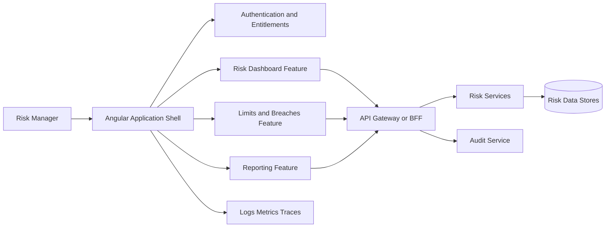
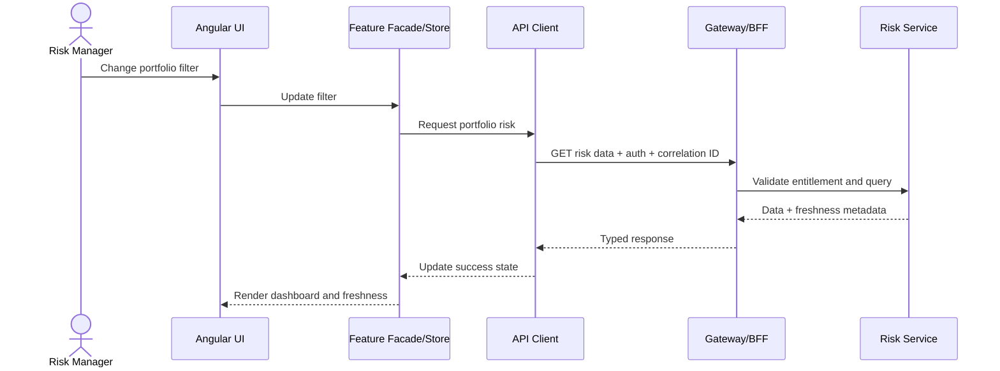

# Build Specification: One-Day Citi Senior UI Developer Interview Prep Website

## Instructions to the Building LLM

Build a polished, local-first interview-preparation web application for a candidate who has **one day** to prepare for a **Senior UI Developer / technical-lead role in Citi Enterprise Risk Technology (ERT), Rutherford, NJ**.

The candidate is already an experienced software engineer and is comfortable with **React**, TypeScript, web architecture, APIs, and modern engineering practices. The largest knowledge-transfer need is translating that knowledge into **Angular 16+ terminology, patterns, testing practices, and interview-ready explanations**.

Do not create a generic course or a broad interview-question directory. Optimize every screen for these outcomes:

1. Rapidly close the candidate’s Angular-specific gaps.
2. Practice concise, senior-level verbal answers.
3. Rehearse one realistic Angular coding exercise.
4. Rehearse one enterprise front-end architecture exercise.
5. Prepare leadership and risk-domain stories.
6. Finish the day with a timed mock interview and a compact cheat sheet.

The application should be usable immediately after `npm install && npm run dev`, require no account, require no paid services, and persist progress locally.

---

## Product Name

**Risk UI Interview Sprint**

Subtitle:

> One focused day to prepare for Citi ERT’s Senior Angular UI Developer interview.

---

## Job Context

The target organization is Citi Enterprise Risk Technology. The role is a senior, hands-on UI developer/technical lead serving global risk-management users.

The job description prioritizes:

- Angular 16+.
- JavaScript, TypeScript, HTML5, CSS, Bootstrap, JSON, and Ajax/HTTP.
- Jasmine and Karma.
- Micro-frontends.
- Docker-based application hosting.
- Git, Jira, Agile, and Scrum.
- Continuous integration and deployment, including TeamCity, uDeploy, or Jenkins.
- Cypress as a preferred skill.
- MongoDB/NoSQL as a secondary preferred skill.
- High- and low-level system design.
- Sequence diagrams and class diagrams.
- Code reviews, test reviews, and technical-document reviews.
- Enterprise web portals and large-scale intranet/internet applications.
- Technical leadership, mentoring, operating standards, delivery ownership, and limited supervision.
- Communication with business and technical stakeholders.
- Rapid reprioritization in a fast-paced, visible environment.

Treat the job description above as the authoritative scope. Do not dilute the app with unrelated interview material.

---

## Time Constraint

The candidate has **one day**, assumed to be approximately eight focused hours plus breaks.

The product must aggressively prioritize high-probability topics. Every module must display:

- Estimated time.
- Priority: `Critical`, `Important`, or `Optional`.
- Learning objective.
- “Good enough for tomorrow” exit criteria.
- A skip button.
- A mark-complete button.

Do not use gamification that wastes time. Progress indicators, timers, and confidence ratings are useful; points, badges, avatars, and animations are not.

---

## Recommended Stack

Build a client-side application with:

- Vite.
- React 18+.
- TypeScript in strict mode.
- React Router.
- Tailwind CSS or clean CSS modules.
- Zustand or a small context/reducer for app state; avoid unnecessary complexity.
- LocalStorage for persistence.
- Vitest and React Testing Library for the app’s own tests.
- Mermaid for architecture and sequence diagrams.
- A lightweight Markdown renderer for study content.
- Optional Monaco Editor only if it does not materially slow implementation; otherwise use a well-designed textarea/code panel.

No backend is required. Do not add authentication, a database, analytics, or external AI calls to the MVP.

The interview content is about Angular, even though the prep website itself is implemented in React. Use this intentionally: show Angular concepts beside their closest React equivalents.

---

## Design Principles

### Information density

The candidate is technically advanced and time-constrained. Favor compact, scannable content over tutorial-style prose.

### Active recall

Most learning interactions should require the candidate to retrieve or explain something before revealing the answer.

### Interview realism

Prompts should ask for decisions, trade-offs, failure modes, and production implications—not definitions alone.

### React-to-Angular transfer

Use React as the bridge, but do not falsely present concepts as identical. Explicitly call out where analogies break down.

### Senior-level framing

Every major technical answer should connect implementation details to some combination of:

- Correctness.
- Security.
- Performance.
- Maintainability.
- Operational resilience.
- Delivery risk.
- Team ownership.
- Business/risk-user outcomes.

### Local and private

All notes, progress, STAR stories, and confidence scores stay in the browser.

---

## Primary User Journey

1. Open the app and see the one-day plan.
2. Enter the actual interview start time, if known.
3. Rate confidence in each topic from 1–5.
4. Let the app recommend a prioritized schedule.
5. Complete short Angular/React comparison drills.
6. Practice Jasmine/Karma tests.
7. complete a code-review exercise.
8. Rehearse the risk-dashboard architecture prompt.
9. Draft and practice leadership stories.
10. Run a timed mock interview.
11. Review only missed questions and low-confidence areas.
12. Print or export a one-page final cheat sheet.

---

## One-Day Schedule

Create a dashboard containing this default schedule. Permit editing and reordering, but keep these defaults prominent.

| Block | Duration | Priority | Outcome |
|---|---:|---|---|
| Orientation and diagnostic | 20 min | Critical | Identify the three highest-risk gaps |
| Angular mental model through React | 70 min | Critical | Explain Angular architecture and lifecycle confidently |
| RxJS and state management | 55 min | Critical | Choose operators and state boundaries for realistic cases |
| Break | 10 min | — | Reset |
| Jasmine/Karma testing lab | 60 min | Critical | Write and explain component/service tests |
| Angular coding and code review | 70 min | Critical | Complete one practical exercise and review flawed code |
| Lunch | 30 min | — | Reset |
| Micro-frontend/system-design lab | 75 min | Critical | Design a risk portal and defend trade-offs |
| Docker, CI/CD, and controls | 35 min | Important | Explain build-to-production flow |
| Risk-domain and security primer | 30 min | Important | Speak credibly about risk-user needs and controls |
| Leadership story builder | 45 min | Critical | Prepare four concise STAR-L stories |
| Timed mock interview | 60 min | Critical | Complete technical, design, and behavioral simulation |
| Final review and cheat sheet | 30 min | Critical | Review misses and print last-minute notes |

Add a “Compressed 4-hour mode” that keeps only:

- Angular mental model.
- RxJS/state.
- Jasmine/Karma.
- One coding exercise.
- One architecture exercise.
- Four leadership stories.
- Twenty-minute rapid-fire mock.

---

## Application Structure

Use this route structure:

```text
/
/diagnostic
/angular-bridge
/rxjs-state
/testing-lab
/coding-lab
/code-review
/system-design
/devops-controls
/risk-domain
/leadership
/mock-interview
/cheat-sheet
/settings
```

Persistent layout:

- Left navigation on desktop.
- Bottom or drawer navigation on mobile.
- Current module timer.
- Overall day progress.
- “Low-confidence queue” shortcut.
- Global search across cards/questions.
- Dark mode.

---

## Dashboard

The home screen should answer three questions instantly:

1. What should I study next?
2. How much focused time remains?
3. What am I least confident about?

Include:

- Today’s editable schedule.
- Overall completion percentage.
- Current recommended activity.
- Topic confidence heat map.
- Missed-question count.
- STAR-story readiness status.
- “Start focus session” button.
- “Start mock now” button.
- “Generate final review queue” button.

Recommendation logic can be deterministic:

```text
score = priorityWeight × (6 - confidence) × incompleteWeight
```

Suggested weights:

- Critical: 3.
- Important: 2.
- Optional: 1.
- Incomplete: 1.5.
- Completed: 0.5.

Do not pretend this is AI. Label it “priority recommendation.”

---

## Diagnostic

Create a 15–20 minute diagnostic with approximately 20 questions. Mix self-rating, multiple choice, and short-answer prompts.

Cover:

- Angular component and dependency-injection model.
- `OnPush` change detection.
- Signals versus RxJS.
- `switchMap`, `mergeMap`, `concatMap`, and `exhaustMap`.
- Reactive forms.
- Route guards and HTTP interceptors.
- NgRx concepts.
- Jasmine spies and Angular test utilities.
- Karma’s role.
- Cypress boundaries.
- Micro-frontend trade-offs.
- Docker deployment.
- Sequence diagrams.
- Security and authorization.
- Production incidents.
- Code-review leadership.

Results should update topic confidence and create a personalized review queue. Short answers should be self-scored by showing a rubric; do not attempt unreliable automated semantic grading.

---

## Angular Through React

This is the most important content module. Build it as paired concept cards with:

- React concept.
- Angular counterpart.
- Similarity.
- Critical difference.
- Interview-ready explanation.
- One example.
- One trap question.
- “Explain aloud” timer for 60–90 seconds.

Include at least these mappings:

| React | Angular | Important distinction |
|---|---|---|
| Function component | Component class + template + metadata | Angular has framework-managed DI, templates, and lifecycle conventions |
| Props | `@Input()` / signal inputs | Angular bindings and change detection differ from React render semantics |
| Callback prop | `@Output()` / event emitter | Angular template event binding is explicit |
| `useState` | Signal or component field | Plain fields and signals trigger/view-update behavior differently |
| `useMemo` | `computed()` or pure pipe | Angular memoization and dependency tracking use different mechanisms |
| `useEffect` | Lifecycle hooks, effects, or RxJS pipeline | Do not describe `ngOnInit` as a direct `useEffect` equivalent |
| Context | Hierarchical dependency injection | DI provides scoped services; it is not merely shared render state |
| Redux | NgRx Store/Effects/Selectors | NgRx is RxJS-centric and effects model side effects explicitly |
| React Router | Angular Router | Guards, resolvers, lazy routes, and DI integration are core Angular patterns |
| Controlled form | Reactive FormControl/FormGroup | Angular reactive forms expose observable status/value streams |
| Fetch/Axios | `HttpClient` | Angular returns observables and commonly uses interceptors |
| Error boundary | `ErrorHandler`, router/error UI patterns | Angular does not have a perfect component error-boundary equivalent |
| React.lazy | Lazy-loaded Angular routes/features | Packaging and DI boundaries differ |
| React Testing Library | Angular TestBed + DOM-oriented assertions | TestBed configures an Angular dependency/template environment |

Required Angular cards:

### Components and templates

Explain:

- Component metadata.
- Template binding syntax.
- Property, event, and two-way binding.
- Structural control flow.
- Content projection.
- Standalone components.
- Smart/container versus presentational components.

### Dependency injection

Explain:

- Root, route, component, and environment provider scope.
- Service lifetimes.
- Injection tokens.
- Constructor/inject-function usage.
- Why accidental provider placement can create multiple instances.

### Change detection

Explain:

- Default strategy.
- `OnPush` behavior.
- Signals and view updates.
- Observable emissions through `async` pipe.
- Immutable state and reference identity.
- Expensive template expressions.
- `trackBy` or modern equivalent identity handling.
- How to profile before optimizing.

Include a prompt:

> A large risk table updates every second and the entire page becomes sluggish. Explain how you would determine whether the problem is network volume, state updates, change detection, DOM size, or rendering.

### Lifecycle and cleanup

Cover:

- Construction versus initialization.
- Input changes.
- View/content initialization.
- Destruction.
- `DestroyRef` and `takeUntilDestroyed`.
- Why nested subscriptions and unmanaged global listeners are dangerous.

### Signals and RxJS

Teach this framing:

- Signals are useful for synchronous reactive state and derived values.
- RxJS remains appropriate for asynchronous streams, cancellation, combination, retry, and event pipelines.
- They can interoperate; the choice is not ideological.
- An interview answer should state ownership, lifecycle, and failure semantics.

---

## RxJS and State Lab

Build scenario-based drills rather than operator flashcards alone.

Required scenarios:

1. **Risk search:** cancel the previous request when filters change → `switchMap`.
2. **Save button:** ignore repeated submissions until completion → `exhaustMap`.
3. **Ordered updates:** preserve order of dependent writes → `concatMap`.
4. **Independent enrichment:** process several independent requests with bounded concurrency → `mergeMap`.
5. **Dashboard composition:** combine latest values from multiple filters/data sources.
6. **Shared stream:** avoid duplicate HTTP calls while handling replay/cache lifetime carefully.
7. **Failure handling:** recover one inner request without terminating a long-lived outer stream.
8. **Cleanup:** stop work when the component is destroyed.

For every drill, require the user to select:

- Operator.
- Cancellation semantics.
- Ordering semantics.
- Error boundary.
- Cleanup strategy.

Then reveal the answer and trade-offs.

Add an NgRx mini-module covering:

- Store.
- Actions.
- Reducers.
- Selectors.
- Effects.
- Entity normalization.
- Facade pattern.
- When NgRx is excessive.

Ask the candidate to classify state as:

- Ephemeral component state.
- Form state.
- URL/router state.
- Shared client state.
- Server state/cache.
- Streaming state.
- User preference state.

---

## Testing Lab

The job description explicitly prioritizes Jasmine and Karma, so make this a hands-on module.

### React-to-Angular test mapping

| React ecosystem | Angular ecosystem |
|---|---|
| Vitest/Jest runner | Karma runner in this target stack |
| Jest/Vitest assertion and mocks | Jasmine assertions and spies |
| React Testing Library render | Angular `TestBed` and fixture |
| `screen` queries | Native element or Angular testing-library queries |
| Mock Service Worker | `HttpTestingController` for unit-level HTTP tests |
| `act`/async utilities | Fixture change detection, `fakeAsync`, `tick`, `waitForAsync` |

Explain that:

- Jasmine supplies test syntax, expectations, and spies.
- Karma launches browsers, runs tests, and reports results.
- TestBed creates/configures the Angular test environment.
- Cypress should focus on critical browser workflows rather than duplicating every unit case.

### Required exercise

Provide a small Angular-like code sample for a `RiskLimitComponent` and `RiskLimitService`.

Behavior:

- Load a risk limit by portfolio ID.
- Show loading state.
- Render utilization percentage.
- Show warning at 80% and breach at 100%.
- Handle zero, missing, stale, and malformed data.
- Show an error and retry action on failure.
- Restrict acknowledgement action based on entitlement.

Ask the candidate to write or complete tests for:

- Successful load.
- Threshold boundaries at 79.99%, 80%, 99.99%, and 100%.
- HTTP error.
- Retry.
- Missing data.
- Permission-disabled action.
- Observable cleanup.
- Accessible status message.

Provide a revealable model answer and commentary on test quality.

### Testing interview prompts

Include:

- What should be mocked and what should remain integrated?
- How do you avoid brittle component tests?
- How do you test timers and RxJS streams deterministically?
- How do you prevent flaky Cypress tests?
- What tests run on every pull request versus before deployment?
- Is coverage percentage enough? Why not?
- How do contract tests protect a micro-frontend/API boundary?

---

## Coding Lab

Create one primary 45-minute exercise and two 15-minute fallbacks.

### Primary exercise: risk-record explorer

Ask the candidate to implement or finish an Angular feature that:

- Fetches paginated risk records.
- Supports a debounced text filter.
- Cancels stale requests.
- Supports sorting.
- Displays loading, empty, stale, and error states.
- Uses strict TypeScript types.
- Uses `OnPush`.
- Avoids leaked subscriptions.
- Includes at least three unit tests.
- Includes accessible labels and keyboard-operable controls.

The website does not need to execute a real Angular compiler. It may present editable code, requirements, hints, and model solutions. If Monaco is included, support side-by-side files and a timer. Otherwise use syntax-highlighted code blocks plus textareas for candidate notes.

### Fallback exercise A: snapshot plus deltas

Given an initial array of risk records and a stream of create/update/delete events:

- Merge events by ID.
- Ignore stale versions.
- Detect a sequence gap.
- Preserve deterministic ordering.
- Discuss complexity.

### Fallback exercise B: code transformation

Transform nested exposure data into grouped table rows with totals while handling missing values and duplicate identifiers.

### Coding rubric

Score manually from 0–2 in each category:

- Clarifies requirements.
- Correctness.
- Type safety.
- RxJS semantics.
- Angular structure.
- Error/empty/loading handling.
- Tests.
- Accessibility.
- Complexity/performance.
- Communication.

---

## Code-Review Lab

Display a deliberately flawed Angular component containing:

- `any` types.
- Business logic in the template.
- Nested subscriptions.
- No cancellation.
- A subscription leak.
- Mutable shared state.
- An expensive template method.
- Missing row identity tracking.
- Client-only permission checking.
- Silent error swallowing.
- Logging of sensitive data.
- One oversized component.
- Weak tests coupled to implementation details.

Ask the candidate to review it as a senior lead.

Require findings to be categorized as:

- Correctness.
- Security/control.
- Performance.
- Testability.
- Maintainability.
- Operational risk.

Require prioritization:

- Block merge.
- Fix before release.
- Schedule follow-up.
- Optional improvement.

The model answer should explain that a strong lead does not dump a long style list on the author. They identify material risk first, explain why it matters, suggest a practical correction, and distinguish blocking issues from coaching suggestions.

---

## System-Design Lab

### Main prompt

> Design a scalable enterprise risk-management portal for global risk managers. It aggregates several risk categories, provides dashboards and drill-down views, enforces role-based access, supports multiple globally distributed development teams, and must be auditable and operationally resilient.

Add an on-screen 45-minute phase timer:

| Phase | Time |
|---|---:|
| Clarify requirements | 5 min |
| Scale, risk, and nonfunctional requirements | 5 min |
| High-level architecture | 10 min |
| Front-end and data-flow details | 10 min |
| Security, controls, and resilience | 7 min |
| Delivery, testing, and observability | 5 min |
| Trade-offs and recap | 3 min |

### Requirement checklist

Prompt the candidate to ask about:

- User personas.
- Read versus write workflows.
- Real-time, near-real-time, or batch freshness.
- Dataset and user scale.
- Availability and latency targets.
- Regional/legal-entity boundaries.
- Entitlements.
- Audit and approval requirements.
- Export behavior.
- Data lineage and reconciliation.
- Recovery objectives.

### Expected architecture areas

- Angular shell.
- Domain-aligned feature boundaries.
- Shared design system.
- Typed API clients.
- State boundaries.
- REST and optional streaming flows.
- API gateway or BFF.
- Authentication and server-enforced authorization.
- Observability and correlation IDs.
- Deployment and rollback.
- Stale-data indicators and partial-failure behavior.

### Micro-frontend decision matrix

Build an interactive matrix comparing:

- Modular monolith.
- Build-time packages in a monorepo.
- Module Federation/runtime micro-frontends.
- Web components.
- iframe isolation.

Axes:

- Team autonomy.
- Independent deployment.
- Runtime isolation.
- Framework/version flexibility.
- Shared dependency complexity.
- UX consistency.
- Testing complexity.
- Operational overhead.

The correct teaching point is not “micro-frontends are best.” The candidate should justify them through team ownership and release independence, then address their costs.

### Mermaid diagrams

Include editable Mermaid templates.

High-level component diagram starter:



Sequence diagram starter:



Require the candidate to add:

- Cancellation or superseded request.
- Unauthorized response.
- Timeout/partial failure.
- Retry policy.
- Audit/telemetry event.

### Design rubric

Score from 0–2:

- Requirements clarification.
- Domain boundaries.
- Angular architecture.
- Data/state design.
- Performance.
- Security and entitlements.
- Auditability/data freshness.
- Resilience.
- Testing/deployment/observability.
- Trade-off communication.

---

## DevOps and Controls

Create a concise “build to production” walkthrough:

1. Developer creates a branch and commits through Git.
2. Pull request triggers lint, type checking, unit tests, and static analysis.
3. Review includes code, design, tests, and control considerations.
4. CI creates a production Angular build.
5. Multi-stage Docker build packages static assets or a BFF/containerized server.
6. Dependency, license, secret, and image scanning run.
7. An immutable artifact is promoted through environments.
8. Automated smoke/Cypress tests run.
9. Deployment uses approval gates appropriate to the environment.
10. Monitoring validates health; feature flags or rollback limit impact.

Important teaching points:

- Browser-delivered Angular configuration is visible to users; never place secrets in it.
- Prefer promoting one immutable artifact over rebuilding separately in every environment.
- Explain how TeamCity or Jenkins can run the pipeline; do not require tool-specific memorization.
- Explain uDeploy as deployment orchestration at a conceptual level.
- Include source maps, release identifiers, health checks, and rollback considerations.
- Tie every stage to fast feedback, repeatability, traceability, or risk reduction.

Add rapid-fire prompts:

- What belongs in the Docker image?
- How are environment-specific API URLs supplied?
- How do you handle failed database/API compatibility after a UI deployment?
- How do you prevent dependency drift?
- What blocks a release?
- How do feature flags affect testing and cleanup?

---

## Security and Risk Domain

### Security checklist

Include active-recall cards for:

- XSS prevention.
- Content Security Policy.
- CSRF.
- Secure cookies and token handling.
- CORS misconceptions.
- Server-side authorization.
- Role and entitlement checks.
- Sensitive data in logs and browser storage.
- Clickjacking.
- Dependency/supply-chain risk.
- Safe file export.
- Audit events.
- Correlation IDs.
- Session timeout and reauthentication.

For each card ask:

1. What is the threat?
2. What is the browser/UI mitigation?
3. What must the server enforce?
4. How would the control be tested or monitored?

### Risk-domain primer

Teach only enough vocabulary to support credible architecture and UX answers:

- Exposure.
- Limit.
- Utilization.
- Threshold.
- Breach.
- Exception.
- Approval.
- Reconciliation.
- Data lineage.
- Data freshness.
- Aggregation.
- Legal entity.
- Risk category.
- Audit trail.

Emphasize these UI implications:

- Always show “as of” timestamps where freshness matters.
- Distinguish no data from zero.
- Make partial and stale data visually explicit.
- Preserve precision and state rounding rules.
- Support drill-down from an aggregate to its sources.
- Enforce entitlements on the server even if the UI hides actions.
- Ensure important acknowledgements and changes are auditable.
- Avoid color as the only breach indicator.

---

## Leadership Story Builder

Create a structured editor for four required stories:

1. Production incident and root-cause prevention.
2. Technical disagreement or design trade-off.
3. Mentoring or raising engineering quality.
4. Security/control concern or stopping a risky release.

Optional stories:

- Rapid reprioritization.
- Legacy modernization.
- Ambiguous business requirements.
- Cross-team delivery.
- Personal failure and learning.

Use **STAR-L** fields:

- Situation.
- Task and personal ownership.
- Actions and alternatives considered.
- Result with honest evidence/metrics.
- Learning and institutionalized improvement.

Add quality checks:

- Is personal ownership clear?
- Is the answer under two minutes?
- Is there a measurable or observable result?
- Does it explain trade-offs?
- Does it include communication?
- Does it include risk/control thinking?
- Does it avoid blaming others?
- Does it explain what changed afterward?

Include an “Answer aloud” mode with a two-minute timer and optional browser voice recording if simple to implement. Voice data must remain local and be clearly deletable. If recording adds too much complexity, omit it and retain the timer.

---

## Mock Interview

Create a timed 60-minute mock with four sections.

### Section 1: Angular depth — 15 minutes

Randomly choose five:

- Explain `OnPush` change detection.
- Compare signals and observables.
- Explain provider scopes in Angular DI.
- Prevent leaked subscriptions.
- Compare reactive and template-driven forms.
- Explain HTTP interceptors.
- Diagnose unnecessary component updates.
- Explain lazy loading and route guards.
- Structure a feature with facade/store/service/components.

### Section 2: Testing and coding — 15 minutes

Randomly choose:

- Write a Jasmine service test.
- Test an HTTP error and retry.
- Review a nested-subscription bug.
- Select an RxJS flattening operator.
- Implement snapshot-plus-delta merging.

### Section 3: Architecture — 15 minutes

Use the ERT risk-portal prompt. Require discussion of micro-frontends, security, data freshness, observability, and deployment.

### Section 4: Leadership — 15 minutes

Randomly choose three:

- Production incident.
- Mentoring.
- Design disagreement.
- Rapid priority change.
- Risky release.
- Communicating with business stakeholders.

For each response:

- Start timer.
- Hide answer guidance until the response is complete.
- Let the candidate score confidence 1–5.
- Reveal a rubric and strong-answer outline.
- Add weak areas to the final review queue.

Do not automatically claim answers are correct. Use self-assessment rubrics.

---

## Question Bank

Seed at least 60 questions:

- 15 Angular/TypeScript.
- 10 RxJS/state.
- 10 Jasmine/Karma/Cypress.
- 10 architecture/micro-frontend.
- 5 Docker/CI/CD.
- 5 security/risk-domain.
- 10 leadership/behavioral.

Each question object should contain:

```ts
type InterviewQuestion = {
  id: string;
  category:
    | 'angular'
    | 'rxjs-state'
    | 'testing'
    | 'architecture'
    | 'devops'
    | 'security-risk'
    | 'leadership';
  priority: 'critical' | 'important' | 'optional';
  prompt: string;
  followUps: string[];
  strongAnswerPoints: string[];
  redFlags: string[];
  estimatedMinutes: number;
  reactBridge?: string;
};
```

Question behavior:

- Show prompt first.
- Candidate answers aloud or in notes.
- Reveal strong-answer points.
- Candidate marks `Missed`, `Partial`, or `Strong`.
- Candidate rates confidence 1–5.
- `Missed` and `Partial` questions enter the review queue.

---

## Final Cheat Sheet

Create a print-friendly one-page or compact multi-page view. It should be generated from both fixed high-value content and the candidate’s weak areas.

Required fixed sections:

### Angular

- `OnPush`: reference/input changes, events, observable/signal updates, explicit marking; profile before optimizing.
- DI: understand provider scope and service lifetime.
- Cleanup: `DestroyRef` / `takeUntilDestroyed` and avoid nested subscriptions.
- Forms: typed reactive forms for complex enterprise workflows.
- Performance: measurement, identity tracking, virtualization, pure computations, lazy loading.

### RxJS

- `switchMap`: replace/cancel.
- `mergeMap`: concurrent.
- `concatMap`: ordered.
- `exhaustMap`: ignore while active.
- Place `catchError` at the boundary whose failure should be contained.

### Testing

- Jasmine = specs/assertions/spies.
- Karma = browser runner/reporting in this stack.
- Test behavior, boundaries, errors, and accessibility.
- Cypress = critical integrated browser journeys.

### Architecture

- Requirements before boxes.
- Separate ephemeral, form, URL, server, shared, and streaming state.
- Justify micro-frontends through organizational boundaries.
- Include security, freshness, partial failure, observability, deployment, and rollback.

### Risk

- Zero is not no data.
- Show freshness and partial-data status.
- Server enforces entitlements.
- Preserve auditability and lineage.

### Leadership

- Ownership.
- Alternatives and trade-offs.
- Communication.
- Measurable result.
- Root-cause prevention.

Also include:

- Four saved STAR-L story titles and key result lines.
- Five lowest-confidence questions.
- Candidate’s “Why Citi ERT?” answer.
- Five questions to ask interviewers.

Add Print and “Copy as Markdown” actions.

---

## “Why Citi ERT?” Builder

Provide a short fill-in framework:

```text
I’m interested in this role because it combines [hands-on Angular/front-end strength]
with [enterprise architecture/technical leadership] in a domain where
[correctness, controls, and data clarity] directly matter to users.

My experience with [specific project] maps well because I [specific ownership/action]
and achieved [result]. I’m particularly interested in helping ERT
[modernize/build scalable risk platforms] while remaining hands-on and
raising engineering standards across the team.
```

Warn against:

- Generic prestige statements.
- Claiming deep risk expertise without evidence.
- Talking only about management.
- Saying the role is attractive merely because it uses Angular.

---

## Questions to Ask Citi

Include a selectable list:

### Technical

- What Angular version and upgrade cadence does the team currently use?
- How is state managed today—NgRx, signals, services, or a combination?
- What micro-frontend implementation is in production, and what problems led to that choice?
- How are the shell, design system, shared dependencies, and release compatibility governed?
- What are the largest current performance or maintainability constraints?
- How are unit, contract, Cypress, and environment tests divided?

### Role

- What percentage of this role is coding, architecture, reviews, and mentoring?
- Which technical decisions would this person own?
- What would excellent performance look like after six months?
- How is work split across the globally distributed team?
- What production-support responsibilities exist?

### Product and risk

- Which risk-management workflows and user personas does the team support?
- What are the most important correctness, freshness, and control requirements?
- How is feedback collected from risk managers?
- Which parts of the platform are being modernized versus maintained?

---

## Data Model

Use local persistence with a versioned schema:

```ts
type AppState = {
  schemaVersion: number;
  schedule: ScheduleBlock[];
  topicConfidence: Record<string, number>;
  moduleProgress: Record<string, ModuleProgress>;
  questionResults: Record<string, QuestionResult>;
  stories: LeadershipStory[];
  designNotes: string;
  codingNotes: string;
  whyCiti: string;
  selectedInterviewerQuestions: string[];
  settings: {
    darkMode: boolean;
    interviewTime?: string;
    compressedMode: boolean;
  };
};
```

Requirements:

- Auto-save after changes.
- Export all data as JSON.
- Import from JSON.
- Reset with confirmation.
- Never transmit data.
- Handle schema migration defensively.

---

## Accessibility

The prep application itself should demonstrate the standards the candidate may discuss:

- Semantic landmarks and headings.
- Full keyboard navigation.
- Visible focus states.
- Proper labels and descriptions.
- No color-only status indicators.
- Sufficient contrast.
- `aria-live` for timer completion only where appropriate.
- Reduced-motion support.
- Accessible dialogs.
- Table captions and correct headers.
- Print styles that preserve structure.

Add a small “Why this is accessible” note in the settings/about screen, so the candidate can use the application as a concrete refresher.

---

## Visual Design

Use a restrained enterprise aesthetic:

- Dense but readable layout.
- White/charcoal backgrounds.
- Dark navy primary color.
- Red only for warnings or missed items.
- Amber for partial confidence.
- Green for completed/strong.
- Monospace font for code.
- Minimal motion.
- Clear cards, tabs, timers, and rubrics.

Do not mimic Citi branding or logos. The website is an independent study tool.

---

## Non-Goals

Do not build:

- User accounts.
- Cloud sync.
- A backend.
- Social features.
- General job-search functionality.
- Resume rewriting.
- Hundreds of shallow LeetCode problems.
- A full Angular course.
- Automatic grading that pretends to understand free-form answers.
- An AI chatbot unless explicitly added after the MVP.

---

## Implementation Order

Build in this order so the app remains useful if time runs out:

### Phase 1: Usable core

1. App shell and routes.
2. Dashboard and one-day schedule.
3. Local persistence.
4. Angular-through-React cards.
5. Question-bank interaction.
6. Final review queue.

### Phase 2: High-value practice

7. Testing lab.
8. Coding exercise.
9. Code-review lab.
10. System-design prompt and Mermaid diagrams.
11. Leadership story builder.

### Phase 3: Simulation

12. Timed mock interview.
13. Dynamic cheat sheet.
14. Print/copy/export.

### Phase 4: Polish

15. Accessibility review.
16. Mobile layout.
17. Dark mode.
18. Import/export and reset.
19. Automated tests.

Do not postpone meaningful content until after visual polish.

---

## Minimum Viable Product

The MVP is complete when it has:

- A working one-day dashboard.
- At least 30 strong interview questions.
- Angular-versus-React concept cards.
- RxJS operator scenarios.
- One Jasmine/Karma testing exercise.
- One coding/code-review exercise.
- One risk-portal system-design exercise.
- Four editable STAR-L stories.
- A timed mock interview.
- A print/copy cheat sheet.
- LocalStorage persistence.
- Responsive, keyboard-accessible UI.

If implementation time is constrained, reduce visual polish and question count before removing these features.

---

## Acceptance Criteria

### Functional

- The app starts with documented commands.
- All routes load without errors.
- Progress survives refresh.
- Confidence and question results update the review queue.
- Timers can start, pause, resume, and reset.
- Mock questions are selected without immediate repetition.
- Cheat sheet incorporates low-confidence topics and saved stories.
- Data export/import works.
- Print layout is readable.

### Content

- Angular concepts are accurate and not described as identical to React concepts.
- Jasmine, Karma, TestBed, and Cypress have clearly separated roles.
- Micro-frontend content includes costs and alternatives.
- Architecture content includes server-side authorization, freshness, partial failure, auditability, observability, and rollback.
- Leadership prompts emphasize ownership and measurable outcomes.
- Risk examples distinguish zero, missing, stale, and partial data.

### Quality

- TypeScript strict mode passes.
- No `any` except where justified and documented.
- No console errors in normal use.
- Core state/recommendation utilities have tests.
- Key user flows have React Testing Library coverage.
- Keyboard navigation works.
- No secrets or network dependencies are required.

---

## Seed Content: Rapid-Fire Answers

Include these concise answer outlines in the content database.

### Explain `OnPush`

- Reduces unnecessary checking by relying on explicit update triggers and stable boundaries.
- Common triggers include changed input references, events in the component, observable emissions consumed by `async`, signal updates, and explicit change-detector calls.
- It works best with immutable state, stable identities, pure view computations, and measured performance.
- It is not a magic switch; large DOMs, expensive grids, and excessive stream emissions still require virtualization, batching, and profiling.

### Signals versus RxJS

- Signals are strong for synchronous local/shared state and derived values.
- RxJS is strong for asynchronous pipelines, cancellation, concurrency, combination, retry, and event streams.
- Use interoperability where appropriate instead of forcing one abstraction everywhere.
- State ownership, lifecycle, error behavior, and readability should drive the choice.

### Why micro-frontends?

- Use them when independently owned domains need meaningful release autonomy.
- Define shell, routing, authentication, design-system, telemetry, and dependency contracts centrally.
- Accept costs: version skew, duplicated dependencies, integration testing, runtime failures, and UX inconsistency.
- Prefer a modular monolith or build-time packages when independent runtime deployment is not valuable.

### Jasmine versus Karma

- Jasmine provides specs, assertions, and spies.
- Karma runs tests in browsers and reports results.
- Angular TestBed configures components, templates, dependency injection, and test fixtures.
- CI commonly runs headless browser tests with coverage and machine-readable results.

### Client-side authorization

- Hiding a button improves UX but does not enforce access control.
- The server must authenticate the caller and authorize every protected operation.
- The UI should handle unauthorized responses safely and avoid exposing unnecessary sensitive data.
- Important actions should create appropriate audit evidence.

### Production incident

- Establish impact and contain harm first.
- Assign incident ownership and communicate clearly.
- Diagnose using evidence and correlation across UI, API, and data layers.
- Recover safely and verify business correctness.
- Separate root cause from contributing factors.
- Add tests, monitoring, controls, ownership, and deadlines that prevent recurrence.

---

## Seed Content: Red Flags

Display these before the mock:

- “I am mostly an architect now and do not code much.”
- Treating Angular as React with different syntax.
- Recommending NgRx for every state problem.
- Recommending micro-frontends without organizational justification.
- Ignoring Jasmine/Karma because newer tools exist.
- Discussing Docker without immutable artifacts, scanning, configuration, or rollback.
- Treating UI role checks as security enforcement.
- Ignoring stale, missing, or partially loaded risk data.
- Giving incident stories centered on heroics or blame.
- Giving code-review feedback without prioritizing material risk.
- Drawing architecture before clarifying users, scale, freshness, and controls.
- Claiming optimization without profiling or measurements.

---

## README Requirements

Generate a README containing:

- Product purpose.
- Prerequisites.
- Install and run commands.
- Test and build commands.
- Architecture overview.
- Data/privacy statement.
- How to edit the question/content data.
- Known limitations.
- A short “One-day usage guide.”

Suggested commands:

```bash
npm install
npm run dev
npm test
npm run build
npm run preview
```

---

## Final Build Instruction

First produce a short implementation plan and file tree. Then implement the application in vertical slices, keeping it runnable after each slice. Seed it with substantive content rather than placeholders. Prefer a complete, focused MVP over unfinished advanced features. After implementation, run type checking, tests, and a production build; fix all blocking errors and report any remaining limitations honestly.
